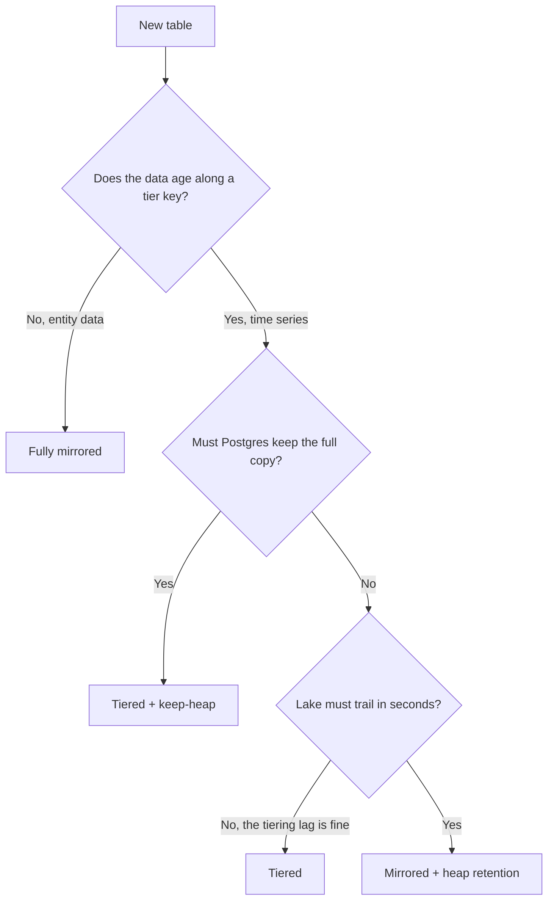

# Choosing a mode

Every registered table picks one of four modes, and the right one follows from the shape of the data. This page is the decision. The definitions live in [Concepts](../getting-started/concepts.md), and the full operation matrix in [The contract](contract.md).

## Start from the shape of the data

**Entity data** (vehicles, users, accounts, catalogs): register it **fully mirrored**. These tables have no aging axis, rows update in place forever, and any table with a primary key qualifies. Postgres keeps the whole copy and takes plain DML with no routing rules, while CDC trails every change into the lake for analytics. Reads stay plain heap scans and cost exactly what they did before TierDB.

**Time-series and event data** (telemetry, logs, clickstreams, transactions): usually Postgres should hold only a recent window, so the choice is between **tiered** and **mirrored with heap retention**. Both need `PARTITION BY RANGE` on the tier key (a timestamp, date, or integer column), both drop old heap partitions, and both read as one seam-split view. What differs is how rows travel to the lake. And when Postgres should keep everything anyway, **tiered keep-heap** moves batches to the lake without dropping the heap copy.

## Tiered or mirrored with heap retention

**Tiered** moves data in batches. Whole partitions behind the tiering lag are written to Iceberg in bulk and dropped from the heap. There is no replication slot, no WAL decoding, and no per-row overhead, which makes it the cheaper choice as volume grows. Corrections to rows that already moved cold land in `tierdb.delta`. Lake freshness equals the tiering lag, and it is the only mode with bounded total history (`--lake-retention`).

**Mirrored with heap retention** moves data by CDC. A replication pump trails every change into the lake row by row, so the lake is behind by seconds rather than by the tiering lag, and every intermediate version of a row is captured. That freshness has a price: a logical replication slot, `REPLICA IDENTITY FULL`, WAL headroom while the pump is down, and one pump decoding every change the table makes. At high ingest volume that per-row decode is the bottleneck tiered does not have.

So the tiebreaker is freshness versus volume. If lake consumers can wait for the tiering lag, tier it. If the lake must trail in near real time, or recent rows are updated so often that the delta would work overtime, mirror with heap retention and pay the CDC cost.

## Tiered keep-heap: batches to the lake, nothing deleted

Sometimes the heap copy should stay whole. Postgres comfortably holds the volume, plain DML on any row is worth keeping, but analytics still belongs in the lake and the seam view should push old scans there. `--keep-heap` is tiered with the drop turned off: partitions are copied to Iceberg in batches (no replication slot, no per-row WAL decode) and the cut-line advances, but heap partitions are never dropped. A row trigger on tiered partitions mirrors any later change into `tierdb.delta`, so plain `INSERT`/`UPDATE`/`DELETE` works everywhere, exactly like a mirrored table, while reads split at the seam.

Compared to fully mirrored, keep-heap trades lake freshness (the tiering lag, not seconds) for batch economics on high-volume streams. It requires range partitioning like any tiered table, and it excludes `--lake-retention`, because keep-heap means nothing is deleted anywhere.

## Side by side

| | Tiered | Tiered + keep-heap | Fully mirrored | Mirrored + heap retention |
|---|---|---|---|---|
| Fits | high-volume time series | time series Postgres keeps whole | entities and dimensions | time series needing a fresh lake |
| Postgres holds | recent partitions | everything | everything | a bounded window |
| Lake freshness | the tiering lag | the tiering lag | seconds (CDC) | seconds (CDC) |
| Write cost at scale | bulk partition moves | bulk partition moves | per-row WAL decode | per-row WAL decode |
| Historical writes | routed to the delta | plain DML, trigger-mirrored | plain DML | routed to the delta |
| Prerequisites | range partitioning | range partitioning | a primary key | range partitioning, a slot |
| Bounded history | yes (`--lake-retention`) | no | no | no |
| Reads | seam-split | seam-split | plain heap, opt-in [hybrid](../tables/reading.md#mirrored-tables-heap-or-hybrid) | seam-split |

## Changing your mind

Modes are set at registration. To switch, `tierdb-worker unregister` (the lake table survives by default) and `register` again in the new mode. See [Day-2 operations](../operations/day-2.md#unregister).
