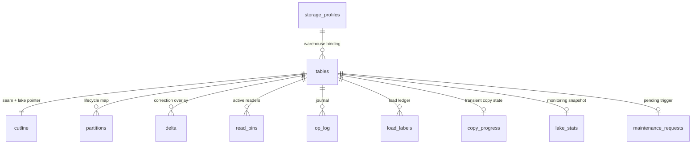

# Catalog schema

The `tierdb.*` tables are the coordination contract between the extension and the workers. They are the only channel, there is no RPC. Every atomic handoff is a plain Postgres transaction. The schema lives in `sql/catalog.sql` and is created and migrated automatically by the worker at startup (`tierdb.schema_meta` stamps the installed version).

All columns stay executor-portable (plain ints, text, jsonb) because `pg_duckdb` may push read-path queries down to DuckDB.

## Data model

Each table models one concern. `tierdb.tables` holds registration config and nothing else: everything that changes at runtime lives in its own row keyed by `table_id`, and all of it cascades on unregister.



## `tierdb.storage_profiles`

Named warehouse bindings tables register against (see [Storage profiles](../tables/storage-profiles.md)). The seeded `default` profile has a blank warehouse and `NULL` format, both meaning "resolve from the worker's environment". A partial unique index keeps exactly one default.

| Column | Meaning |
|--------|---------|
| `profile_name` | Primary key, referenced by `tierdb.tables.storage_profile` |
| `lake_format` | Lake plugin id. `NULL` = worker env |
| `warehouse` | Warehouse root. `''` = worker env |
| `lake_config` | Non-secret `key=value` config overrides, any provider |
| `credential_ref` | Names a credential set in the worker's environment (`TIERDB_CREDENTIALS_<REF>`). `NULL` = worker default |
| `is_default` | The profile new registrations get without `--profile` |

## `tierdb.tables`

Registered logical tables. One row per registration, written at register time and only touched again for policy edits. CHECK constraints keep mode-specific columns coherent (mirror plumbing only on mirrored rows, retention and keep-heap only on tier-splitting rows).

| Column | Meaning |
|--------|---------|
| `table_id` | The user table's OID, as bigint |
| `schema_name`, `table_name` | The registered relation |
| `primary_key_cols` | Merge key (array, composite keys supported) |
| `tier_key_col` | The aging column rows tier by |
| `tier_key_type` | The column's native type (`bigint`, `timestamptz`, `timestamp`, `date`). All catalog tier-key values are canonical bigint, see [the seam protocol](seam.md#tier-key-types) |
| `partition_scheme` | Lake partition layout, e.g. `{"width": 3600}` |
| `lake_format` | Lake plugin id (`iceberg`) |
| `lake_table_ref` | The format's name for the cold table (path or catalog identifier) |
| `storage_profile` | The [storage profile](../tables/storage-profiles.md) the lake lives on |
| `mode` | `tiered`, `direct`, or `mirrored` |
| `publication_name`, `slot_name` | Mirrored: CDC plumbing |
| `heap_retention_lag` | Mirrored: heap retention window. `NULL` = keep all |
| `lake_retention_lag` | Tiered: expire lake rows this far behind the cut-line. `NULL` = keep forever |
| `keep_heap` | Tiered: never drop heap partitions, a trigger mirrors their DML into the delta |
| `maintenance_policy` | Per-table maintenance overrides (format-interpreted keys). `NULL` = all defaults |

## `tierdb.cutline`

The seam, per table, always advanced together in one transaction. The published lake pointer lives here because it must move in the same row-update as `S`: a reader that sees the cut-line sees the matching physical pointer.

| Column | Meaning |
|--------|---------|
| `tier_key_hi` | `T`: rows with `tier_key >= T` live in Postgres |
| `lake_snapshot_id` | `S`: pinned cold-store version consistent with `T` |
| `replicated_lsn` | `F`: the mirror frontier (WAL position). `NULL` for tiered tables |
| `retention_line` | `R`: lake rows with `tier_key < R` are expired. `NULL` = nothing expired yet |
| `lake_props` | The published pointer to `S`, e.g. Iceberg's `metadata_location` and `snapshot_id` |

Connectors reading the seam should treat `retention_line` as the floor of the table: rows below it exist in old lake snapshots but not in the current one, and writes targeting them are rejected by the extension.

## `tierdb.partitions`

Partition lifecycle map: `hot → sealing → tiering → tiered → dropped`, with tier-key bounds per partition.

## `tierdb.delta`

The correction overlay for cold rows, merged on read, folded by compaction.

| Column | Meaning |
|--------|---------|
| `pk` | Canonical text PK (composite keys joined with `chr(31)`, escaped) |
| `op` | `0` = upsert, `1` = tombstone |
| `tier_key` | Of the target cold row (`< T`) |
| `old_tier_key` | Set when the row moved tiers: the partition the lake still holds the image in, where the fold's delete lands |
| `version` | Newest-wins ordering (sequence-assigned), guards the fold clear |
| `payload` | Row image. Tombstones keep the pk fields |

## `tierdb.read_pins`

Active read pins. The oldest pin is the reclaim and compaction horizon. Pins are transaction-scoped rows with an `expires_at` bound.

## `tierdb.op_log`

Idempotency + crash-resume journal for every lake-writing operation (`op_id`, `op_kind`, `phase`, snapshot, details). Op kinds: `tiering`, `compaction`, `maintenance`, `retention`, `ingest`, `load`.

## `tierdb.load_labels`

The Stream Load label ledger: a label commits with its batch, replays return the recorded result, `staged` labels await lake adoption.

## `tierdb.maintenance_requests`

Pending out-of-schedule maintenance triggers, at most one per table. `tierdb-worker maintain` and the console upsert a row (`requested_by` records who asked), the leader claims it with a `DELETE ... RETURNING` so exactly one run fires. The result lands in `tierdb.op_log` like any scheduled pass.

## `tierdb.lake_stats`

Lake health, one row per table, refreshed by the worker. `stats` and `warnings` are owned by the format plugin (counter names and health judgments differ per format), `policy` is a snapshot of the maintenance settings the table ran with at collection time.

## `tierdb.copy_progress`

In-flight mirrored initial copies: the slot's consistent point, the last copied PK, and chunks done. The row exists only while the copy runs, and a re-run of `register` resumes from it.

## `tierdb.status`

The operational view, one row per table for humans and dashboards:

```sql
SELECT * FROM tierdb.status;
--  table_id | schema_name | table_name | mode | cutline_t | cutline_s |
--  mirror_frontier | retention_line | cutline_updated_at | delta_backlog |
--  read_pins | copying | partition_states
```
